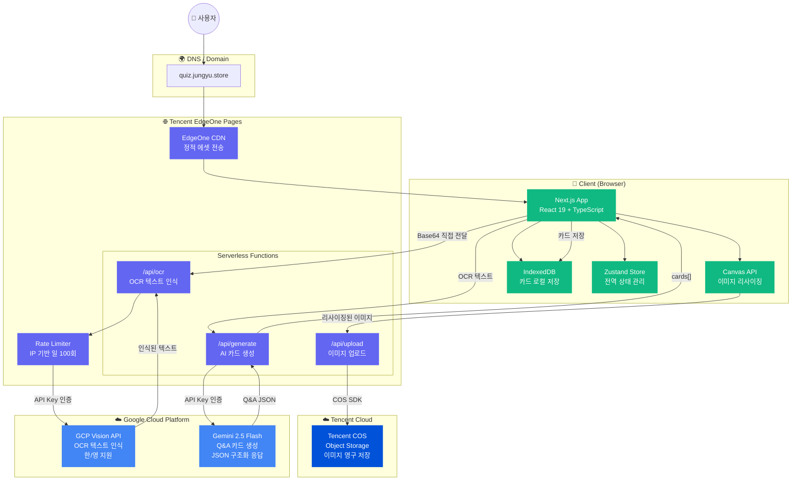
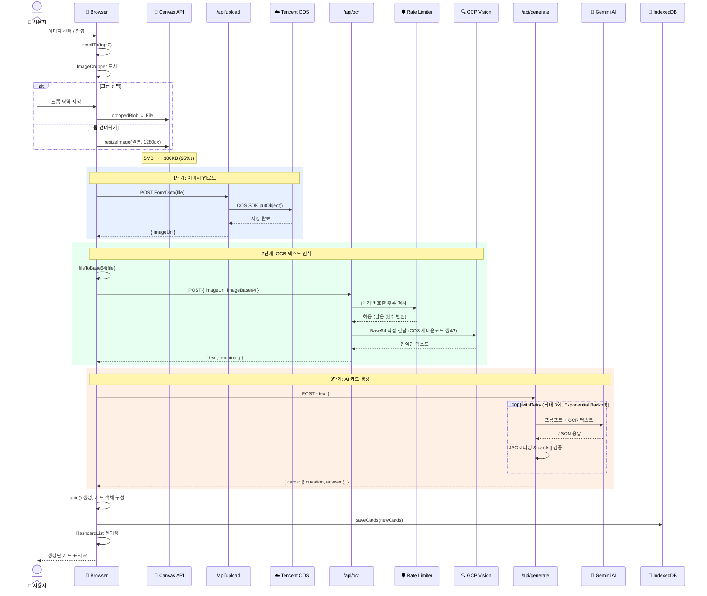
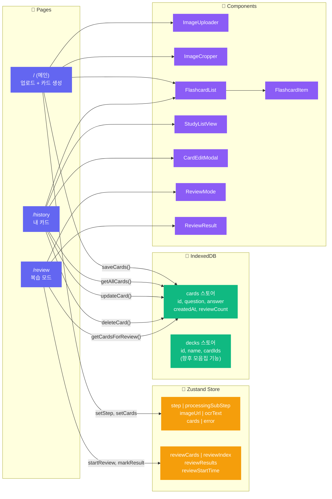
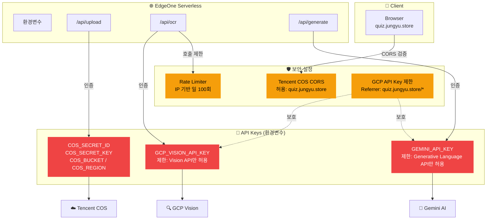

# QuizDive 시스템 아키텍처

> 본 문서는 QuizDive의 전체 시스템 구성과 주요 데이터 흐름을 Mermaid 다이어그램으로 시각화합니다.

---

## 1. 전체 시스템 아키텍처

멀티 클라우드(Tencent Cloud + Google Cloud) 환경에서 서버리스로 동작하는 전체 구성도입니다.



### 아키텍처 설명

| 계층 | 구성 요소 | 역할 |
|------|---------|------|
| **Client** | Next.js App, Canvas API, IndexedDB, Zustand | 사용자 인터페이스, 이미지 전처리, 로컬 데이터 관리, 전역 상태 |
| **EdgeOne** | CDN + Serverless Functions | 정적 에셋 전송, 3개 API 엔드포인트 서버리스 실행 |
| **Tencent Cloud** | COS (Object Storage) | 업로드된 이미지의 영구 저장 |
| **Google Cloud** | Vision API + Gemini API | OCR 텍스트 인식 + AI 카드 생성 |

**핵심 설계 결정:**
- **멀티 클라우드 분업**: 호스팅/스토리지는 Tencent, AI 서비스는 GCP로 분리. 각 클라우드의 강점을 활용하면서 특정 벤더 종속을 방지.
- **API Key 기반 인증**: 서버리스 환경의 제약(파일 시스템 없음)으로 인해 Service Account JSON 대신 API Key로 인증. GCP 콘솔에서 허용 API를 제한하여 보안 확보.
- **로컬 우선 저장**: 인증 시스템 없이도 사용 가능하도록 IndexedDB에 카드를 저장. 네트워크 없이도 복습 가능.

---

## 2. 이미지 → 카드 생성 파이프라인

사용자가 이미지를 업로드하면 카드가 생성되기까지의 **전체 요청 시퀀스**입니다.



### 파이프라인 설명

**AS-IS vs TO-BE (504 타임아웃 해결 전후):**

| 단계 | AS-IS (개선 전) | TO-BE (개선 후) |
|------|:---:|:---:|
| 이미지 크기 | 5MB (원본) | ~300KB (Canvas 리사이징) |
| 2단계 OCR | COS에서 이미지 재다운로드 → Base64 변환 → Vision | 클라이언트 Base64 직접 수신 → Vision |
| 불필요한 왕복 | COS 재다운로드 1~2초 | 0초 (제거) |
| 3단계 AI | 1회 시도, 토큰 2048 | 최대 3회 재시도, 토큰 4096 |
| **총 소요** | **20~45초 💥 타임아웃** | **3~8초 ✅** |

**주요 최적화 포인트:**
1. **Canvas 리사이징** (`image-utils.ts`): 브라우저에서 이미지를 최대 1280px로 리사이징. Vision API는 해상도가 아닌 텍스트 인식이 목적이므로 품질 손실 최소화.
2. **Base64 직접 전달**: `/api/ocr`가 `imageBase64` 파라미터를 직접 수신. COS에서 재다운로드하는 불필요한 네트워크 왕복 제거.
3. **Exponential Backoff**: Gemini API의 간헐적 오류에 대비한 재시도 로직. 1초 → 2초 → 4초 대기 후 재시도.

---

## 3. 클라이언트 상태 & 데이터 흐름

브라우저 내부에서의 상태 관리와 데이터 저장 흐름입니다.



### 데이터 흐름 설명

**상태 관리 전략:**

| 데이터 | 관리 방식 | 이유 |
|--------|---------|------|
| 처리 단계 (`step`) | Zustand | 페이지 내 실시간 UI 전환에 사용. 영속 불필요 |
| 처리 중 서브 단계 | Zustand | 프로그레스 UI용 일시 상태 |
| 생성된 카드 | **IndexedDB** | 영속 저장 필요. 새로고침/재방문 후에도 유지 |
| 복습 진행 상태 | Zustand | 복습 세션 동안만 유지. 세션 종료 시 리셋 |
| 뷰 모드 (`card/study`) | `useState` | 페이지 내 로컬 상태. 전역 공유 불필요 |

**IndexedDB 스키마:**

```
quizdive-db (v1)
├── cards (keyPath: id)
│   ├── index: by-created (createdAt)
│   └── Record: { id, question, answer, createdAt, lastReviewedAt?, reviewCount, nextReviewAt? }
└── decks (keyPath: id)
    └── Record: { id, name, description?, cardIds[], createdAt }
```

---

## 4. API 인증 및 보안 구성

멀티 클라우드 환경에서의 인증 흐름과 보안 설정입니다.



### 보안 설계 원칙

| 원칙 | 구현 |
|------|------|
| **최소 권한** | 각 API Key는 해당 서비스(Vision / Gemini)만 호출 가능하도록 제한 |
| **Key 분리** | Vision용, Gemini용 Key를 분리하여 탈취 시 피해 범위 최소화 |
| **Referrer 제한** | GCP API Key에 HTTP Referrer 화이트리스트 적용 |
| **CORS 제한** | COS 버킷의 CORS 정책을 프로덕션 도메인으로 한정 |
| **Rate Limiting** | IP 기반 일일 호출 횟수 제한으로 API 남용 방지 |
| **환경변수** | 모든 시크릿을 `.env.local`과 배포 환경변수에서 관리. 코드에 하드코딩 금지 |
